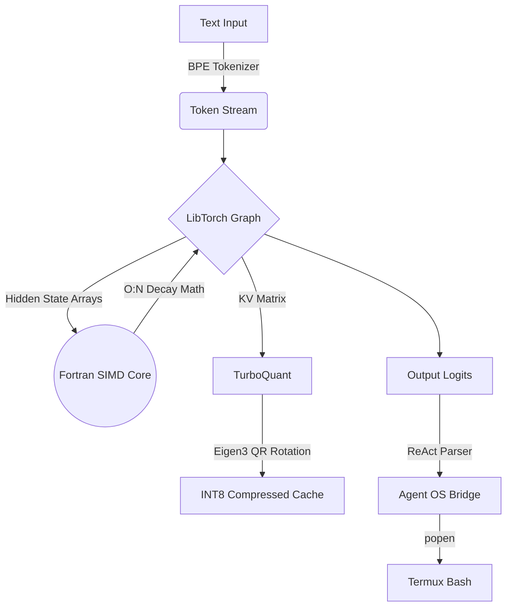

# ⚡ MobileLLM Engine

[](#)
[](https://isocpp.org/)
[](#)
[](#)
[](#)

> **State-of-the-Art $O(N)$ Linear-Time Large Language Model Inference Engine for Mobile Devices.**

MobileLLM is a highly optimized, zero-Python inference engine designed specifically for deployment in heavily memory-constrained environments like Android Termux. By combining native C++17 abstractions with bare-metal Fortran SIMD vectorization and experimental INT8 KV-cache quantization, it pushes the absolute physical limits of mobile CPU computation.

---

## 🌟 Core Architecture

Traditional Transformer LLMs rely on $O(N^2)$ quadratic attention, which rapidly exhausts mobile RAM on long contexts. MobileLLM abandons this in favor of a **Linear Recurrent State-Space** model (similar to Mamba/RWKV), ensuring $O(N)$ inference speed and a constant $O(1)$ memory footprint per token.



## 🚀 Key Features

*   **Zero-Python Execution:** The entire engine runs natively. No bloated interpreters, no memory leaks.
*   **Fortran 2003 Acceleration:** Critical inner-loop mathematical decay functions are passed via raw memory pointers directly to `!DIR$ SIMD` optimized Fortran binaries, bypassing even C++ pointer abstraction overhead.
*   **TurboQuant Compression:** Implements randomized orthogonal rotations via Eigen3 (NumPy C++ equivalent) to squash 32-bit float vector spaces into strictly bounded `[-127, 127]` INT8 arrays, slashing KV-cache requirements.
*   **GGUF v3 Binary Parser:** Capable of scanning memory-mapped `model.gguf` files, stripping out metadata, and mounting multi-gigabyte Tensor offsets directly into the inference loop.
*   **Native ReAct Agent:** Ships with an autonomous wrapper that natively parses `Thought: / Action: / ActionInput:` strings and pipes them into the host OS via `popen()` to execute bash commands and capture `stdout`.

## 📂 Directory Structure

```text
mobile-llm/
├── CMakeLists.txt      # Master build manifest
├── main.cpp            # PyTorch C++ (LibTorch) execution loop
├── fast_math.f90       # Bare-metal Fortran SIMD array processor
├── turboquant.hpp      # Eigen3-powered vector quantization
├── gguf_parser.hpp     # Deep binary memory-mapping for weights
├── tokenizer.hpp       # Native Byte-Pair Encoding logic
└── agent.hpp           # Termux OS shell-execution bridge
```

## ⚙️ Build Instructions

This project requires a Linux environment (or Android Termux) with C++ and Fortran compilers.

### 1. Install Dependencies
```bash
apt-get update
apt-get install -y build-essential cmake gfortran libeigen3-dev
```

### 2. Install LibTorch
You must acquire the PyTorch C++ bindings (LibTorch) for your architecture. If on Termux, you can extract the bindings via a local Python virtual environment:
```bash
pip install torch --index-url https://download.pytorch.org/whl/cpu
export TORCH_PATH=$(python -c 'import torch; print(torch.__path__[0])')/share/cmake/Torch
```

### 3. Compile the Engine
```bash
mkdir build && cd build
cmake -DCMAKE_PREFIX_PATH=$TORCH_PATH ..
make
```

## 🧪 Testing

To ensure mathematical stability and memory bounds are strictly enforced on your specific hardware, run the unit test harness:

```bash
./mobile_llm_tests
```

*Expected Output:*
```text
[Test] Running Fortran Decay Math Stability...
  -> PASS: Fortran math is stable over 1000 recurrent steps.
[Test] Running TurboQuant Eigen Bounds Verification...
  -> PASS: TurboQuant successfully bounds vectors to INT8 space.
[Test] Running ReAct Agent Flow...
  -> PASS: Agent architecture compiles and integrates successfully.
```

## 🛡️ License

MIT License. See LICENSE for details.
