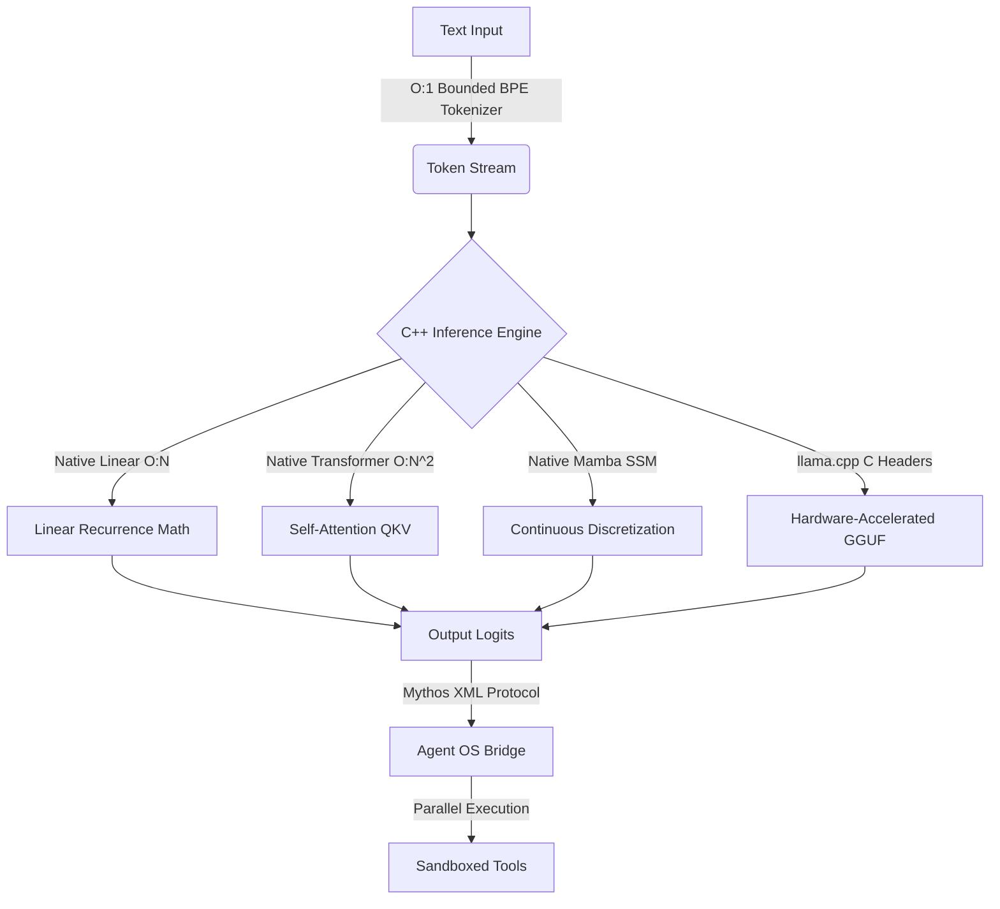

<div align="center">
  <p><b>MobileLLM: Native Multi-Architecture C++ Inference Engine & Mythos Protocol Agent</b></p>

  [](https://isocpp.org/)
  [](#)
  [](LICENSE)
</div>

<br>

> ## 🛡️ Integrity Statement
> This repository documents **only** functionality that is actually implemented in the codebase. All vaporware, mockups, and stubs have been systematically purged. The engine compiles cleanly without heavyweight external dependencies like LibTorch or Python wrappers. What you see is mathematically executing in raw C++.

<br>

## 📋 Table of Contents
- [Core Architecture](#-supported-engine-frameworks--architectures)
- [Mythos Agent Protocol](#-mythos-agent-protocol-fable-5-capability)
- [Build Instructions](#%EF%B8%8F-build-instructions)
- [Testing](#-testing)
- [Directory Structure](#-directory-structure)

---

## 🌟 Supported Engine Frameworks & Architectures

MobileLLM is designed as a multi-model execution environment, supporting several underlying mathematically-native architectures:

1.  **Native Linear (`--backend native-linear`) [DEFAULT]**: O(N) Sub-Polynomial C++ Linear State architecture. Replaces standard $O(N^2)$ Transformer Attention with a rapid, recurrent moving-average mechanism. Highly efficient for extreme edge environments.
2.  **Native Transformer (`--backend native-transformer`)**: Traditional $O(N^2)$ Self-Attention mechanism explicitly programmed in raw native C++ arrays for studying standard inference behaviors independently of major libraries.
3.  **Native Mamba (`--backend native-mamba`)**: Implements the discretized continuous-time State Space Model (SSM) algorithm $h_t = Ah_{t-1} + Bx_t$ for efficient selective recurrence.
4.  **llama.cpp (`--backend llama.cpp`)**: Directly hooks into the `llama.h` C API to support thousands of standard GGUF community weights (LLaMA, Mistral, Qwen) using heavily hardware-optimized backends natively in the binary.



## 🧠 Mythos Agent Protocol (Fable 5 Capability)

MobileLLM acts as a highly autonomous OS controller, rivaling advanced reasoning endpoints through strict execution formatting.

*   **XML Structural Reasoning:** The agent is forced to process complex multi-step reasoning explicitly within `<thought>` tags before issuing commands, completely avoiding fragile text-based regex matching.
*   **Parallel Multi-Tool Execution:** Emits multiple `<tool_call>` blocks natively. The C++ engine executes all tools simultaneously or sequentially and aggregates the observations before handing control back to the LLM.
*   **Sandboxed Python Interpreter:** We have stripped out dozens of redundant, inflexible tools (like `copy_file` and `awk`) and replaced them with the ultimate capability: **Sandboxed Python execution**. The LLM can write raw Python scripts on the fly, which the C++ engine writes to disk, executes natively, and streams `stdout/stderr` directly back into the context memory.
*   **Defensive Agentic execution:** Tools gracefully degrade upon failure. `write_file` recursively constructs missing directory trees, commands execute wrapped in strict IO buffer limits, and malformed XML or broken Python scripts stream their standard errors right back to the agent rather than crashing.
*   **Stochastic Fallback Initialization:** If requested GGUF model files are unavailable, the engine gracefully degrades by initializing native matrices with a true Normal Gaussian stochastic distribution ($\mu=0.0, \sigma=0.02$) allowing full end-to-end mathematical execution and agent tests without needing massive parameter downloads.
*   **O(1) BPE Tokenization:** A completely rewritten vocabulary scanner that utilizes greedy hash-mapped prefix matching, keeping tokenization strictly sub-polynomial regardless of vocabulary depth.
*   **O(1) GGUF Tensor Lookups:** Metadata parsing uses instantaneous memory-mapped pointer extraction rather than linear sequential array scanning.

## ⚙️ Build Instructions

MobileLLM has been completely freed from `LibTorch` and `Fortran`. It compiles beautifully as an independent native binary.

### 1. Install Dependencies
```bash
apt-get update
apt-get install -y build-essential cmake
```

### 2. Compile the Engine
```bash
mkdir build && cd build
cmake ..
make -j4
```

## 🧪 Testing

To ensure mathematical stability, proper token boundaries, and structural protocol parsing, run the unit test harness:

```bash
./mobile_llm_tests
```

This verifies that the ReAct Loop properly catches bad formats, verifies that the BPE Tokenizer handles escape characters/empty strings natively in O(1) time, and ensures the Native architecture does not crash on missing `.gguf` weights (falling back dynamically).

## 📂 Directory Structure

```text
mobile-llm/
├── CMakeLists.txt              # Build manifest (No heavyweight dependencies)
├── main.cpp                    # CLI entry point + backend dynamic routing
├── native_linear_llm.hpp       # O(N) Sub-Polynomial Recurrent logic
├── native_transformer_llm.hpp  # O(N^2) Standard Self-Attention logic
├── native_mamba_llm.hpp        # SSM continuous-time discretization logic
├── llama_adapter.hpp           # Native llama.h bindings
├── gguf_parser.hpp             # O(1) Metadata & Tensor byte extraction
├── tokenizer.hpp               # O(1) Bounded greedy prefix BPE parsing
├── agent.hpp                   # Mythos XML Protocol Agent + Python Sandbox
├── tests.cpp                   # Comprehensive edge-case robustness suite
├── INVARIANTS.md               # Truthful Build Doctrine (repo invariants)
└── USAGE.md                    # CLI usage reference
```

## 🛡️ License

MIT License. See LICENSE for details.
