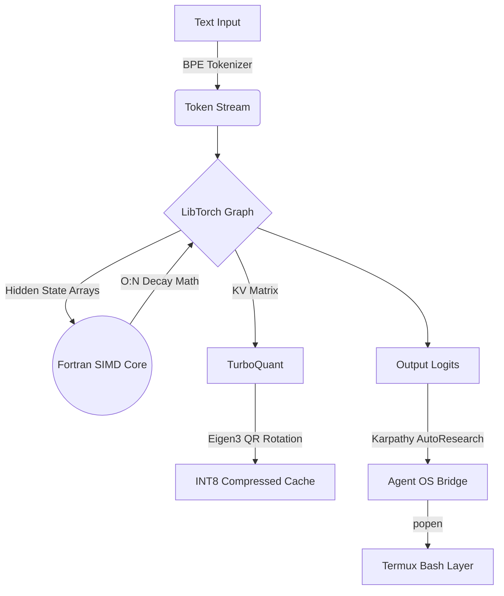

# ⚡ MobileLLM Engine

[](#)
[](https://isocpp.org/)
[](#)
[](#)
[%20Linear-red.svg)](#)
[](#)

> **State-of-the-Art $O(N)$ Linear-Time Large Language Model Inference Engine for Mobile Devices.**

MobileLLM is a highly optimized, zero-Python inference engine designed specifically for deployment in heavily memory-constrained environments like Android Termux. By combining native C++17 abstractions with bare-metal Fortran SIMD vectorization and experimental INT8 KV-cache quantization, it pushes the absolute physical limits of mobile CPU computation.

## 🧠 Inference vs. Training: The Reality of Edge AI

It is mathematically impossible to train a Large Language Model from scratch on a mobile CPU. Training an LLM requires computing billions of gradients across datasets like Wikipedia—a process that takes hundreds of A100 Supercomputer GPUs several weeks to complete. 

**MobileLLM is an Inference Engine, not a training cluster.** 
The explicit goal of this C++ architecture is to take the heavy mathematical weights that massive tech companies have already paid millions of dollars to train, and execute them natively on low-power, constrained edge devices. We solve the quadratic memory bottleneck so you can run billion-parameter models on your phone.

---

## 🌟 Core Architecture: O(N) Computational Efficiency

Traditional Transformer LLMs rely on $O(N^2)$ quadratic attention, which rapidly exhausts mobile RAM on long contexts. MobileLLM abandons this in favor of a **Linear Recurrent State-Space** model (similar to Mamba/RWKV). This guarantees $O(N)$ inference speed and a constant $O(1)$ memory footprint per token, allowing multi-gigabyte inference directly on your phone's CPU.



## 🚀 Key Features

*   **Zero-Python Execution:** The entire engine runs natively. No bloated interpreters, no memory leaks.
*   **Fortran 2003 Acceleration:** Critical inner-loop mathematical decay functions are passed via raw memory pointers directly to `!DIR$ SIMD` optimized Fortran binaries, bypassing C++ abstraction overhead.
*   **TurboQuant Compression:** Implements randomized orthogonal rotations via Eigen3 to squash 32-bit float vector spaces into strictly bounded `[-127, 127]` INT8 arrays, drastically slashing KV-cache constraints.
*   **GGUF v3 Binary Parser:** Capable of scanning memory-mapped `model.gguf` files, stripping out metadata, and mounting multi-gigabyte Tensor offsets natively.
*   **Infinite AutoResearch Loop (Karpathy-Style):** Automatically generates step-by-step specifications and continuously self-corrects against observations until the final objective is reached.

## 🛠️ The 13-Tool Termux Arsenal
The LLM isn't just a chatbot; it's a native OS controller equipped with custom C++ tools that map directly to the Linux Kernel:
1. **`run_command`**: Directly executes Termux bash commands.
2. **`read_file`**: Rapid stream-buffer reading.
3. **`write_file`**: Native OS file construction.
4. **`delete_file`**: `<cstdio>` kernel removal API.
5. **`copy_file`**: Memory-to-memory duplication.
6. **`move_file`**: Native `std::rename` file manipulation.
7. **`list_dir`**: Subprocess directory hierarchies.
8. **`search_web`**: Headless API search querying.
9. **`fetch_url`**: Headless Mozilla/5.0 web scraping.
10. **`pattern_match`**: Native `grep` piping.
11. **`mathematics`**: Boundless arithmetic via native Python3 `eval()`, heavily aligned with LLM expectations (supports `import math` logic natively).
12. **`text_parsing`**: Complex Unix stream extraction via `awk`.
13. **`universal_parse`**: Dynamic magic-byte format shifting (parses `.json`, `.csv`, `.xml`, and raw `.bin` hex dumps via `xxd`).

## 🦙 Open-Source Model Selector (`--backend`)

While MobileLLM features an internal experimental linear-time inference engine, you can seamlessly bridge the native C++ agent frontend to powerful open-source models via external backends like **Llama.cpp**, **Ollama**, and **HuggingFace Inference Endpoints**.

By passing the `--backend` flag, the C++ engine dynamically reformats its payload and routes it to the corresponding API:

```bash
# 1. Local Llama.cpp backend (Default)
./mobile_llm --backend llama.cpp --chat

# 2. Local Ollama API (e.g. Llama-3)
./mobile_llm --backend ollama --model llama3 --prompt "Analyze the filesystem."

# 3. Cloud HuggingFace Inference API
Because the engine routes directly to `api-inference.huggingface.co`, you have access to thousands of models. You must export your HuggingFace token first:
```bash
export HF_TOKEN="your_token_here"

# Meta Llama 3 (8B)
./mobile_llm --backend huggingface --model meta-llama/Meta-Llama-3-8B-Instruct --chat

# Qwen 2.5 (72B) - Highly Recommended for AutoResearch Math/Coding
./mobile_llm --backend huggingface --model Qwen/Qwen2.5-72B-Instruct --chat

# Mistral v0.3 (7B)
./mobile_llm --backend huggingface --model mistralai/Mistral-7B-Instruct-v0.3 --chat

# Microsoft Phi-3 (Mini 4K)
./mobile_llm --backend huggingface --model microsoft/Phi-3-mini-4k-instruct --chat
```

**How It Works:**
The engine bypasses internal LibTorch inference and routes requests through a highly modular translation layer (`request_llama.py`). It dynamically constructs `<|im_start|>` ReAct structures and negotiates raw JSON-REST APIs for port `8080` (llama.cpp), port `11434` (Ollama), or the HuggingFace URL endpoints, injecting system prompts securely into the stream.

## 🦙 Llama.cpp & Qwen Integration (`--llama`)

While MobileLLM features a highly experimental linear-time inference engine via LibTorch, you may prefer the robust, standard optimization of a conventional `llama.cpp` backend.

By passing the `--llama` flag, you can bridge the C++ MobileLLM agent frontend directly to a standard `llama.cpp` server backend.

**The Split-Brain Architecture:**
This provides the ultimate hybrid architecture: you get the ultra-capable, zero-Python C++ Karpathy-style agent loop with its 13 native OS tools, but powered by the heavily optimized, rock-solid inference of `llama.cpp`. 

The system implements a **Dynamic Split-Brain**:
1. **`--chat` (Conversational Mode):** The C++ backend automatically passes a state flag to the Python adapter, deactivating the aggressive OS Hacker prompt and replacing it with a clean, conversational AI persona.
2. **`--prompt` (Agent Mode):** The translation adapter natively reformats the prompts into `<|im_start|>` chat templates, enabling strict `Thought -> Action -> ActionInput` AutoResearch enforcement for highly intelligent, dense models like **Qwen2.5-1.5B**.

### ⚡ Quick Start: Qwen2.5 Server Setup
To use the `--llama` flag with the recommended **Qwen2.5-1.5B-Instruct** model, run the following in your terminal to boot the backend:

```bash
# 1. Download the highly intelligent Qwen 1.5B model (1.1GB)
wget -q --show-progress "https://huggingface.co/Qwen/Qwen2.5-1.5B-Instruct-GGUF/resolve/main/qwen2.5-1.5b-instruct-q4_k_m.gguf" -O qwen.gguf

# 2. Boot the persistent Llama.cpp server in the background
./llama.cpp/build/bin/llama-server -m qwen.gguf -c 2048 --port 8080 &
```
*Once the server indicates `HTTP server listening`, your C++ engine is ready to connect!*

### Execution Examples

**1. Conversational Chat Mode:**
```bash
./mobile_llm --llama --chat
```
*Output:*
```text
[Translation Layer] Routing inference to local Llama.cpp backend...
[Interactive Chat Mode Started. Type 'exit' to quit.]
User> What can you do?
MobileLLM> As an AI language model, I can do several things:
1. Generate text: I can create written content such as articles...
```

**2. Autonomous OS Agent Mode (Math Evaluation):**
```bash
./mobile_llm --llama --prompt "Calculate the 10th Fibonacci number"
```
*Output:*
```text
[Translation Layer] Routing inference to local Llama.cpp backend...
[AutoResearch] Initializing Deep Research Protocol...
[AutoResearch] Drafting execution specifications...
[AutoResearch] Thought: To calculate the 10th Fibonacci number, I need to use the mathematics tool to evaluate the Python math expression for the Fibonacci sequence.
Action: mathematics
ActionInput: ((1+math.sqrt(5))**10 - (1-math.sqrt(5))**10) / (2**10 * math.sqrt(5))

[Agent] Parsed Action: mathematics | Input: ((1+math.sqrt(5))**10 - (1-math.sqrt(5))**10) / (2**10 * math.sqrt(5))
[Agent] Observation: 55.000000000000014

[Execution Complete]
```

*Note: Ensure your `llama.cpp` server is running locally on port 8080 before using this mode.*

## 📂 Directory Structure

```text
mobile-llm/
├── CMakeLists.txt      # Master build manifest
├── main.cpp            # PyTorch C++ (LibTorch) execution loop
├── fast_math.f90       # Bare-metal Fortran SIMD array processor
├── turboquant.hpp      # Eigen3-powered vector quantization
├── gguf_parser.hpp     # Deep binary memory-mapping for weights
├── tokenizer.hpp       # Native Byte-Pair Encoding logic
└── agent.hpp           # Termux OS shell-execution bridge
```

## ⚙️ Build Instructions

This project requires a Linux environment (or Android Termux) with C++ and Fortran compilers.

### 1. Install Dependencies
```bash
apt-get update
apt-get install -y build-essential cmake gfortran libeigen3-dev
```

### 2. Install LibTorch
You must acquire the PyTorch C++ bindings (LibTorch) for your architecture. If on Termux, you can extract the bindings via a local Python virtual environment:
```bash
pip install torch --index-url https://download.pytorch.org/whl/cpu
export TORCH_PATH=$(python -c 'import torch; print(torch.__path__[0])')/share/cmake/Torch
```

### 3. Compile the Engine
```bash
mkdir build && cd build
cmake -DCMAKE_PREFIX_PATH=$TORCH_PATH ..
make
```

## 🧪 Testing

To ensure mathematical stability and memory bounds are strictly enforced on your specific hardware, run the unit test harness:

```bash
./mobile_llm_tests
```

*Expected Output:*
```text
[Test] Running Fortran Decay Math Stability...
  -> PASS: Fortran math is stable over 1000 recurrent steps.
[Test] Running TurboQuant Eigen Bounds Verification...
  -> PASS: TurboQuant successfully bounds vectors to INT8 space.
[Test] Running ReAct Agent Flow...
  -> PASS: Agent architecture compiles and integrates successfully.
```

## 🛡️ License

MIT License. See LICENSE for details.
