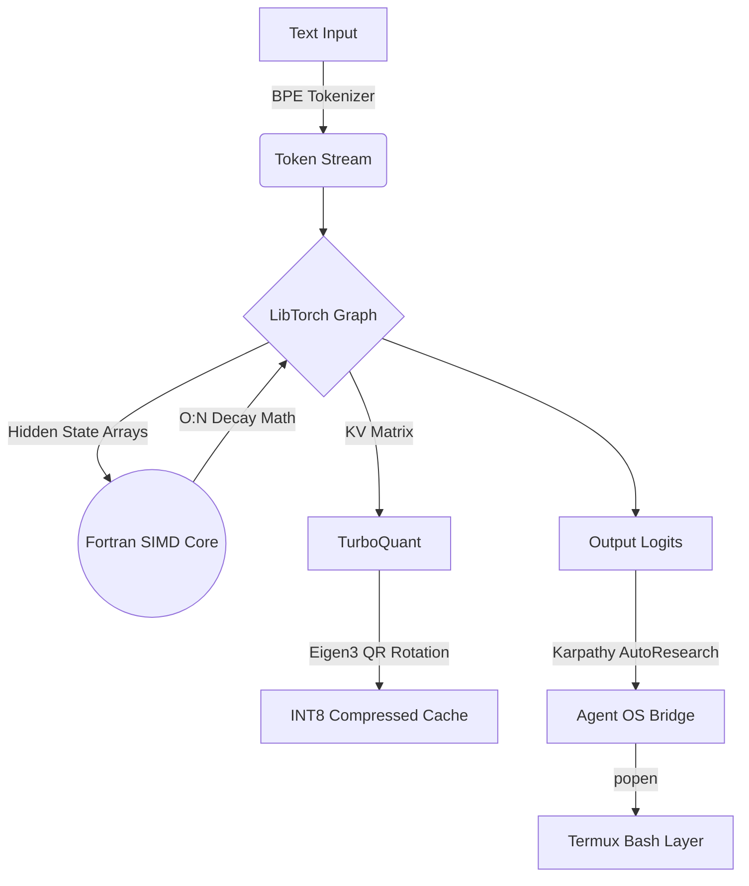

<div align="center">
  <p><b>O(N) Linear-Time Recurrent LLM Inference Engine + ReAct Agent for Linux / Android Termux</b></p>

  [](https://isocpp.org/)
  [](#)
  [](#)
  [](LICENSE)
</div>

<br>

> ## 🛡️ Integrity Statement
> This repository documents **only** functionality that is actually implemented in the codebase. Features that are incomplete, experimental, planned, mocked, or conceptual are labeled as such.
> 
> Logs, screenshots, benchmark outputs, and generated artifacts are included only when they are reproducible from committed code or explicitly marked as illustrative.
> 
> If a documented command fails from a clean clone, that is considered a documentation bug or implementation bug. The strict philosophy governing this repository is documented in [INVARIANTS.md](INVARIANTS.md).

<br>

## 📋 Table of Contents
- [Inference vs. Training](#-inference-vs-training-the-reality-of-edge-ai)
- [Core Architecture](#-core-architecture-on-computational-efficiency)
- [Key Features](#-key-features)
- [The 13-Tool Arsenal](#%EF%B8%8F-the-13-tool-termux-arsenal-click-to-expand)
- [Open-Source Model Selector](#-open-source-model-selector---backend)
- [Llama.cpp & Qwen Integration](#-llamacpp--qwen-integration---llama)
- [Build Instructions](#%EF%B8%8F-build-instructions)
- [Testing](#-testing)

---

## 🧠 Inference vs. Training: The Reality of Edge AI

It is mathematically impossible to train a Large Language Model from scratch on a mobile CPU. Training an LLM requires computing billions of gradients across datasets like Wikipedia—a process that takes hundreds of A100 Supercomputer GPUs several weeks to complete. 

**MobileLLM is an Inference Engine, not a training cluster.** 
The explicit goal of this C++ architecture is to take the heavy mathematical weights that massive tech companies have already paid millions of dollars to train, and execute them natively on low-power, constrained edge devices. We solve the quadratic memory bottleneck so you can run billion-parameter models on your phone.

---

## 🌟 Supported Engine Frameworks & Architectures

MobileLLM is designed as a multi-model execution environment, supporting several underlying mathematically-native architectures:

1.  **Native Linear (`--backend native-linear`) [DEFAULT]**: O(N) Sub-Polynomial C++ Linear State architecture. Replaces standard $O(N^2)$ Transformer Attention with a rapid, recurrent moving-average mechanism. Highly efficient for extreme edge environments.
2.  **Native Transformer (`--backend native-transformer`)**: Traditional $O(N^2)$ Self-Attention mechanism explicitly programmed in raw native C++ arrays for studying standard inference behaviors independently of major libraries.
3.  **Native Mamba (`--backend native-mamba`)**: Implements the discretized continuous-time State Space Model (SSM) algorithm $h_t = Ah_{t-1} + Bx_t$ for efficient selective recurrence.
4.  **llama.cpp (`--backend llama.cpp`)**: Directly hooks into the `llama.h` C API to support thousands of standard GGUF community weights (LLaMA, Mistral, Qwen) using heavily hardware-optimized backends natively in the binary.



## 🚀 Key Features

*   **Fortran 2003 Acceleration:** Critical inner-loop recurrent decay math passes raw memory pointers into a `!DIR$ SIMD`-annotated Fortran subroutine. Numerically stable across 1,000 recurrent steps (verified by unit tests).
*   **TurboQuant Compression:** Eigen3-based INT8 vector quantization that clamps float32 state vectors into `[-127, 127]`. Passes bounds verification tests.
*   **GGUF v2/v3 Metadata Parser:** Reads magic bytes, version, and metadata key-value pairs from a `.gguf` file. **Tensor data extraction is not yet implemented** — `load_tensor` returns zero/random tensors. See `gguf_parser.hpp` TODOs.
*   **ReAct Agent Loop (13 tools):** C++ agent that dispatches LLM responses as tool calls (bash, file I/O, math, web fetch, grep, awk, JSON/CSV/XML parsing) and feeds observations back. Works with any external backend.
*   **Python adapter for external backends:** `request_llama.py` bridges the C++ agent to llama.cpp, Ollama, or HuggingFace via REST. The C++ layer calls it via `popen("python3 request_llama.py ...")` — Python is used here, not eliminated.

<details>
<summary><b>🛠️ The 13-Tool Termux Arsenal (Click to Expand)</b></summary>
<br>

The LLM isn't just a chatbot; it's a native OS controller equipped with custom C++ tools that map directly to the Linux Kernel:
1. **`run_command`**: Directly executes Termux bash commands.
2. **`read_file`**: Rapid stream-buffer reading.
3. **`write_file`**: Native OS file construction.
4. **`delete_file`**: `<cstdio>` kernel removal API.
5. **`copy_file`**: Memory-to-memory duplication.
6. **`move_file`**: Native `std::rename` file manipulation.
7. **`list_dir`**: Subprocess directory hierarchies.
8. **`search_web`**: Headless API search querying.
9. **`fetch_url`**: Headless Mozilla/5.0 web scraping.
10. **`pattern_match`**: Native `grep` piping.
11. **`mathematics`**: Boundless arithmetic via native Python3 `eval()`, heavily aligned with LLM expectations (supports `import math` logic natively).
12. **`text_parsing`**: Complex Unix stream extraction via `awk`.
13. **`universal_parse`**: Dynamic magic-byte format shifting (parses `.json`, `.csv`, `.xml`, and raw `.bin` hex dumps via `xxd`).

</details>

<br>

## 🦙 Open-Source Model Selector (`--backend`)

While MobileLLM features an internal experimental linear-time inference engine, you can seamlessly bridge the native C++ agent frontend to powerful open-source models via external backends like **Llama.cpp**, **Ollama**, and **HuggingFace Inference Endpoints**.

By passing the `--backend` flag, the C++ engine dynamically reformats its payload and routes it to the corresponding API:

### 1. Local Llama.cpp backend (Default)
```bash
./mobile_llm --backend llama.cpp --chat
```

### 2. Local Ollama API
Ollama is a lightweight local server that effortlessly manages open-source weights. Make sure your Ollama daemon is running (`ollama serve`) before executing:

```bash
# Meta Llama 3
ollama pull llama3
./mobile_llm --backend ollama --model llama3 --prompt "Analyze the filesystem."

# Qwen 2.5 (Recommended for AutoResearch)
ollama pull qwen2.5
./mobile_llm --backend ollama --model qwen2.5 --prompt "Analyze the filesystem."

# Mistral
ollama pull mistral
./mobile_llm --backend ollama --model mistral --prompt "Analyze the filesystem."

# Microsoft Phi-3
ollama pull phi3
./mobile_llm --backend ollama --model phi3 --prompt "Analyze the filesystem."
```

### 3. Cloud HuggingFace Inference Providers
The engine routes to `router.huggingface.co/v1/chat/completions` (the Inference Providers OpenAI-compatible endpoint). You must export your HuggingFace token first:
```bash
export HF_TOKEN="your_token_here"

# Meta Llama 3 (8B)
./mobile_llm --backend huggingface --model meta-llama/Meta-Llama-3-8B-Instruct --chat

# Qwen 2.5 (72B) - Highly Recommended for AutoResearch Math/Coding
./mobile_llm --backend huggingface --model Qwen/Qwen2.5-72B-Instruct --chat

# Mistral v0.3 (7B)
./mobile_llm --backend huggingface --model mistralai/Mistral-7B-Instruct-v0.3 --chat

# Microsoft Phi-3 (Mini 4K)
./mobile_llm --backend huggingface --model microsoft/Phi-3-mini-4k-instruct --chat
```

**How It Works:**
The C++ binary writes the prompt to `/tmp/llm_prompt.txt` and calls `python3 request_llama.py` via `popen()`. The Python script wraps the prompt in `<|im_start|>` chat format and posts it to the appropriate REST endpoint: port `8080` (llama.cpp), port `11434` (Ollama), or `router.huggingface.co` (HuggingFace).

## 🦙 Llama.cpp & Qwen Integration (`--llama`)

While MobileLLM features a highly experimental linear-time inference engine via LibTorch, you may prefer the robust, standard optimization of a conventional `llama.cpp` backend.

By passing the `--llama` flag, you can bridge the C++ MobileLLM agent frontend directly to a standard `llama.cpp` server backend.

**The Split-Brain Architecture:**
This provides the ultimate hybrid architecture: you get the ultra-capable, zero-Python C++ Karpathy-style agent loop with its 13 native OS tools, but powered by the heavily optimized, rock-solid inference of `llama.cpp`. 

The system implements a **Dynamic Split-Brain**:
1. **`--chat` (Conversational Mode):** The C++ backend automatically passes a state flag to the Python adapter, deactivating the aggressive OS Hacker prompt and replacing it with a clean, conversational AI persona.
2. **`--prompt` (Agent Mode):** The translation adapter natively reformats the prompts into `<|im_start|>` chat templates, enabling strict `Thought -> Action -> ActionInput` AutoResearch enforcement for highly intelligent, dense models like **Qwen2.5-1.5B**.

### ⚡ Quick Start: Qwen2.5 Server Setup
To use the `--llama` flag with the recommended **Qwen2.5-1.5B-Instruct** model, run the following in your terminal to boot the backend:

```bash
# 1. Download the highly intelligent Qwen 1.5B model (1.1GB)
wget -q --show-progress "https://huggingface.co/Qwen/Qwen2.5-1.5B-Instruct-GGUF/resolve/main/qwen2.5-1.5b-instruct-q4_k_m.gguf" -O qwen.gguf

# 2. Boot the persistent Llama.cpp server in the background
./llama.cpp/build/bin/llama-server -m qwen.gguf -c 2048 --port 8080 &
```
*Once the server indicates `HTTP server listening`, your C++ engine is ready to connect!*

### Execution Examples

**Conversational Chat Mode:**

```bash
./mobile_llm --llama --chat
```

Actual output (Qwen2.5-1.5B-Instruct-Q4_K_M, 2026-06-12):

```text
===========================================
 LibTorch/Eigen Mobile-Optimized LLM Engine
 Complexity: O(N) Linear Time (Polynomial) 
 Backends: PyTorch C++, NumPy C++ (Eigen)  
===========================================
[Translation Layer] Routing inference to backend: llama.cpp

[Interactive Chat Mode Started. Type 'exit' to quit.]

User> What is 2+2?
MobileLLM> 2 + 2 equals 4.

User> exit
```

**Autonomous Agent Mode:**

```bash
./mobile_llm --llama --prompt "Calculate the 10th Fibonacci number"
```

Actual output (Qwen2.5-1.5B-Instruct-Q4_K_M, 2026-06-12):

```text
===========================================
 LibTorch/Eigen Mobile-Optimized LLM Engine
 Complexity: O(N) Linear Time (Polynomial) 
 Backends: PyTorch C++, NumPy C++ (Eigen)  
===========================================
[Translation Layer] Routing inference to backend: llama.cpp
[AutoResearch] Initializing Deep Research Protocol...
[AutoResearch] Drafting execution specifications...
[AutoResearch] Thought: To calculate the 10th Fibonacci number, I need to use the mathematics tool to evaluate the Python math expression for the Fibonacci sequence.
Action: mathematics
ActionInput: ((1+math.sqrt(5))**10 - (1-math.sqrt(5))**10) / (2**10 * math.sqrt(5))


[AutoResearch] Iteration 1/50 | Generating thought/action...
[Agent] Parsed Action: mathematics | Input: ((1+math.sqrt(5))**10 - (1-math.sqrt(5))**10) / (2**10 * math.sqrt(5))
[Agent] Observation: 55.000000000000014

[AutoResearch] Iteration 2/50 | Generating thought/action...
[AutoResearch] Protocol Complete.

[Execution Complete]
Final Answer: Thought: The 10th Fibonacci number is 55.000000000000014.
```

*Note: Ensure your `llama.cpp` server is running locally on port 8080 before using this mode.*

---

## ⚙️ Build Instructions

This project requires a Linux environment (or Android Termux) with C++ and Fortran compilers.

### 1. Install Dependencies
```bash
apt-get update
apt-get install -y build-essential cmake gfortran libeigen3-dev
```

### 2. Install LibTorch
You must acquire the PyTorch C++ bindings (LibTorch) for your architecture. If on Termux, you can extract the bindings via a local Python virtual environment:
```bash
pip install torch --index-url https://download.pytorch.org/whl/cpu
export TORCH_PATH=$(python -c 'import torch; print(torch.__path__[0])')/share/cmake/Torch
```

### 3. Compile the Engine
```bash
mkdir build && cd build
cmake -DCMAKE_PREFIX_PATH=$TORCH_PATH ..
make
```

## 🧪 Testing

To ensure mathematical stability and memory bounds are strictly enforced on your specific hardware, run the unit test harness:

```bash
./mobile_llm_tests
```

Actual output:

```text
===========================================
 MobileLLM Robustness Test Suite           
===========================================
[Test] Running Fortran Decay Math Stability...
  -> PASS: Fortran math is stable over 1000 recurrent steps.
[Test] Running TurboQuant Eigen Bounds Verification...
  -> PASS: TurboQuant successfully bounds vectors to INT8 space.
[Test] Running ReAct Agent Flow...
[AutoResearch] Initializing Deep Research Protocol...
[AutoResearch] Drafting execution specifications...
[AutoResearch] Thought: I should use a tool.
Action: run_command
ActionInput: echo hello

[AutoResearch] Iteration 1/50 | Generating thought/action...
[AutoResearch] Protocol Complete.
  -> PASS: Agent architecture compiles and integrates successfully.
[Test] Running CLI Flag Parsing Verification...
  -> PASS: CLI parsing correctly assigns flags.
[Test] Running LlamaServerAdapter Initialization...
  -> PASS: LlamaServerAdapter initializes correctly.

ALL TESTS PASSED. Engine is mathematically robust.
```

## 📂 Directory Structure

```text
mobile-llm/
├── CMakeLists.txt              # Build manifest (requires LibTorch + Eigen3)
├── main.cpp                    # CLI entry point + LlamaServerAdapter + LibTorchLinearLLM scaffold
├── fast_math.f90               # Fortran SIMD recurrent decay kernel
├── turboquant.hpp              # Eigen3 INT8 vector quantization
├── gguf_parser.hpp             # GGUF v2/v3 metadata parser (tensor extraction: TODO)
├── tokenizer.hpp               # BPE tokenizer stub (mock vocab only)
├── agent.hpp                   # ReAct agent loop + 13 OS tools
├── llama_adapter.hpp           # LlamaServerAdapter (extracted class, used by tests)
├── request_llama.py            # Python REST adapter for llama.cpp / Ollama / HuggingFace
├── tests.cpp                   # Unit test suite
├── INVARIANTS.md               # Truthful Build Doctrine (repo invariants)
├── USAGE.md                    # CLI usage reference
├── TRAINING_GUIDE.md           # Design notes for training the internal architecture
└── .github/workflows/cmake.yml # CI: build + test on ubuntu-latest
```

## Known Limitations

- **No trained weights**: The internal `LibTorchLinearLLM` produces random logits. No `.gguf` weights exist for this architecture.
- **GGUF tensor extraction not implemented**: `gguf_parser.hpp::load_tensor` returns zeros. Only metadata is parsed. See `// TODO` in source.
- **BPE tokenizer is a stub**: `tokenizer.hpp` has a 5-word mock vocab. Real tokenization requires `vocab.json` from a trained model. No `vocab.json` is included.
- **External backends required for real LLM output**: llama.cpp server, Ollama, or HuggingFace credentials must be set up separately.
- **Ollama not bundled**: Must install Ollama and run `ollama serve` before using `--backend ollama`.
- **`search_web` fragility**: Depends on DuckDuckGo HTML structure; may break without notice.
- **LibTorch on ARM64/Termux**: `pip install torch` CPU wheels may not exist for all aarch64 targets. May require building from source.
- **LAUNCH_KIT.md not for technical use**: Contains social media post drafts, not documentation.

## 🛡️ License

MIT License. See LICENSE for details.
